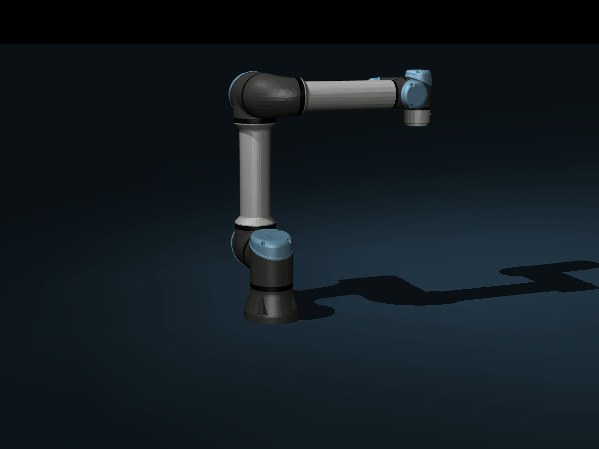
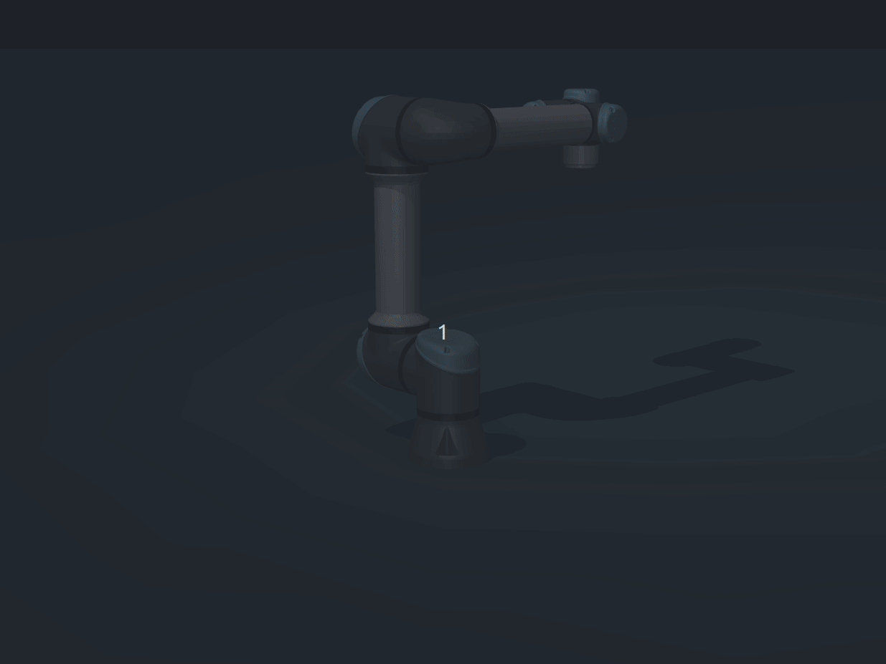
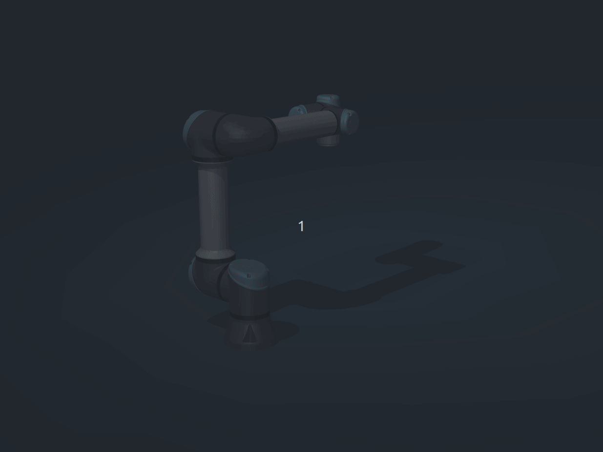
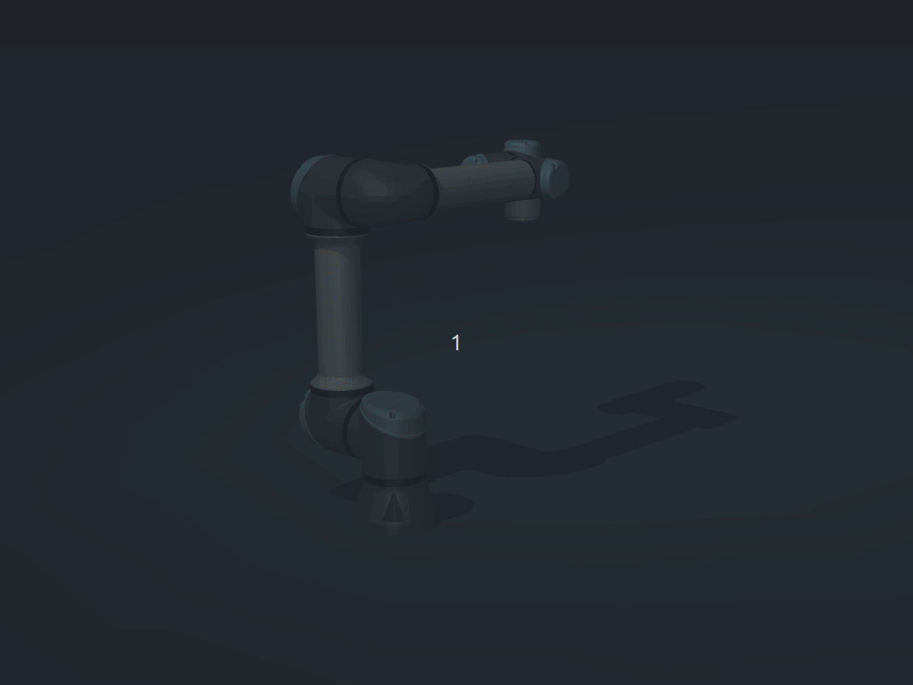

# gravity_comp

基于 **Pinocchio RNEA** 的机械臂重力补偿库，提供纯重力前馈、PD + 重力补偿与位置伺服三种控制律，并可选 **MuJoCo** 仿真验证（UR5e）。

## 核心特性

- Pinocchio RNEA 重力前馈（`τ = g(q)`）
- PD + 重力 / 位置伺服
- MuJoCo UR5e 仿真验证（可选）
- 交互式 viewer 演示

## 演示

| 无补偿（下塌） | PD + 重力补偿 |
| :---: | :---: |
|  |  |

| 重力 hold | 扰动 push |
| :---: | :---: |
|  |  |

## 快速开始

### 依赖

- C++17 编译器、CMake ≥ 3.16
- [Eigen3](https://eigen.tuxfamily.org/)、[Pinocchio](https://stack-of-tasks.github.io/pinocchio/)
- 可选（MuJoCo 仿真与 viewer）：[MuJoCo](https://mujoco.org/)、Python `mujoco` / `pinocchio`、`Catch2`

推荐在已安装 Pinocchio 与 MuJoCo 的 Conda 环境中构建（CMake 会自动使用 `$CONDA_PREFIX`）。

### 构建

```bash
git clone https://github.com/kyrovia/gravity_comp.git
cd gravity_comp

# MuJoCo 仿真需要 Menagerie UR5e 模型
./tools/setup_menagerie.sh

cmake -B build -DGCT_ENABLE_MUJOCO=ON
cmake --build build
```

仅构建核心库（不含 MuJoCo）：

```bash
cmake -B build
cmake --build build
```

### 运行测试

```bash
cd build && ctest --output-on-failure
```

### 启动 MuJoCo 演示

```bash
cmake --build build --target ur5e_mujoco_viewer        # 依次演示三种模式
cmake --build build --target ur5e_mujoco_viewer_hold   # 仅 hold
cmake --build build --target ur5e_mujoco_viewer_push   # 扰动恢复
```

或直接运行 Python viewer：

```bash
python examples/ur5e_mujoco_viewer.py --mode compare --real-time
```

### 最小 API 示例

```cpp
#include "gct/gravity_compensator.hpp"
#include "gct/pin_model.hpp"

gct::PinModel model("/path/to/robot.urdf");
gct::GravityCompensator comp(model);

const gct::VectorXd q = /* 当前关节角 */;
const gct::VectorXd tau_g = comp.gravity_torque(q);           // τ = g(q)
const gct::VectorXd tau_pd = comp.pd_plus_gravity(q, v, q_des, v_des);
```

## 文档

| 资源 | 说明 |
|------|------|
| [`include/gct/`](include/gct/) | 核心 API：`PinModel`、`GravityCompensator` |
| [`include/gct_mujoco/`](include/gct_mujoco/) | MuJoCo 仿真与重力验证 API |
| [`examples/ur5e_mujoco_viewer.py`](examples/ur5e_mujoco_viewer.py) | 交互式 UR5e 演示脚本 |
| [Pinocchio 文档](https://stack-of-tasks.github.io/pinocchio/) | 动力学与 RNEA |
| [MuJoCo Menagerie UR5e](https://github.com/google-deepmind/mujoco_menagerie/tree/main/universal_robots_ur5e) | 仿真模型来源 |

## 许可证

本项目采用 [Apache License 2.0](LICENSE) 发布。
